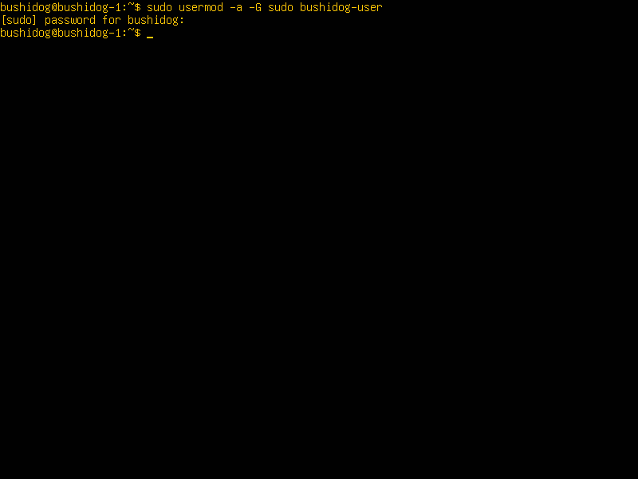
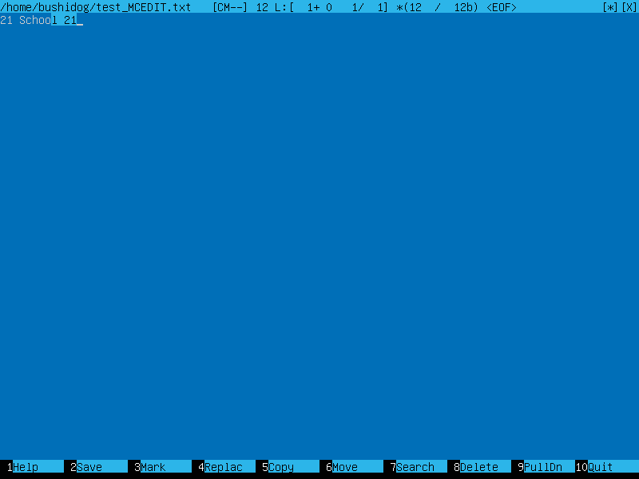
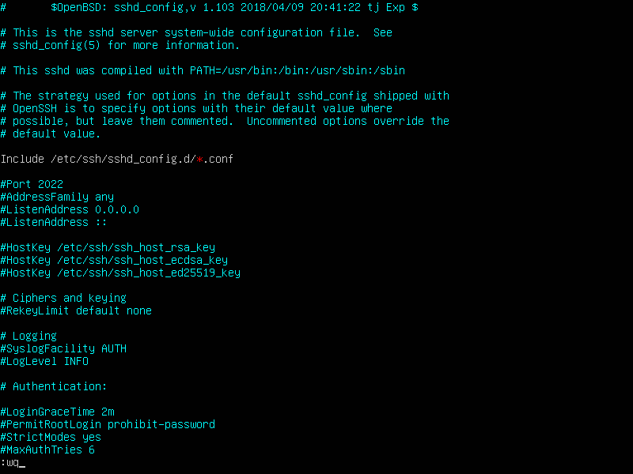

Установка ОС\
\
Создание пользователя\
\
Настройка сети ОС\
\
\
\
\
\
\
lo или local loopback (локальная петля). Служит для подключения по сети к этому же компьютеру и не требует дополнительной настройки;
Dynamic Host Configuration Protocol (DHCP) — автоматический предоставляет IP адреса и прочие настройки сети (маску сети, шлюз и т.п) компьютерам и различным устройствам в сети.\
Обновление ОС\
\
\
Использование команды **sudo**\
\
\
Главное назначение sudo — это выполнить команду от имени другого пользователя, обычно от root. Смысл выполнения команды от root в том, что у него повышенные права доступа и, применяя sudo, обычный пользователь может выполнить те действия, на которые у него недостаточно прав.\
Установка и настройка службы времени\
\
Установка и использование текстовых редакторов\
\
\
\
\
\
\
\
\
\
\
\
Установка и базовая настройка сервиса **SSHD**\
\
\
\
\
\
Установка и использование утилит **top**, **htop**\
\
\
\
\
\
\
\
\
Использование утилиты **fdisk**\
\
\
\
\
\
Установка и использование утилиты **ncdu**\
\
\
\
Работа с системными журналами\
\
Использование планировщика заданий **CRON**\
\
\
\
